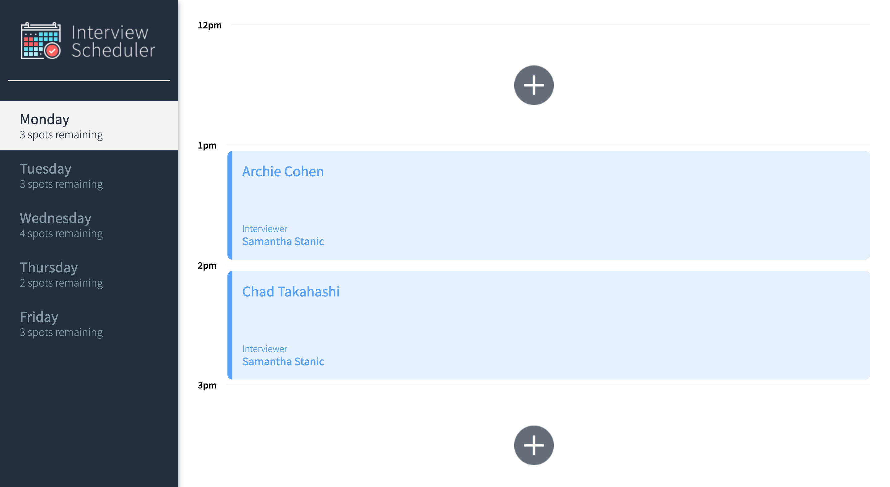
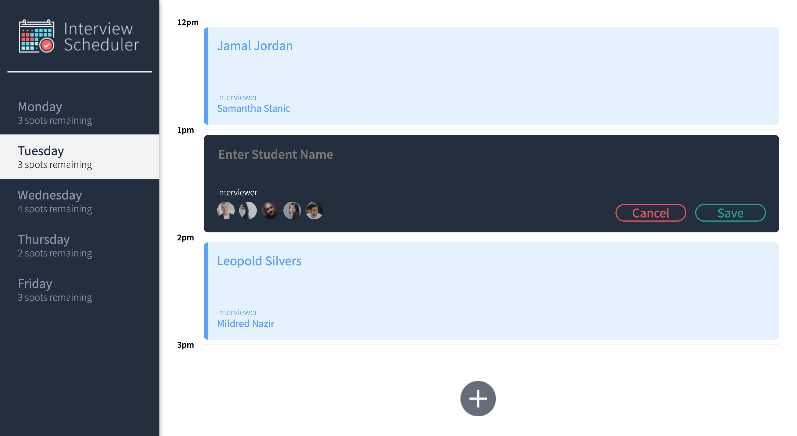
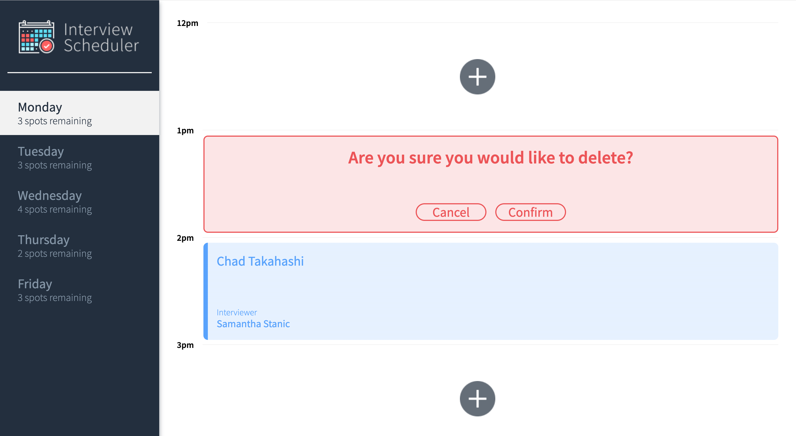

# Interview Scheduler

Build and test a React application that allows users to book and cancel interviews. Combine a concise API with a WebSocket server to build a realtime experience.

## Final Product

### Home Page


### Create an new appointment


### Delete an appointment


## Setup

Install dependencies with `npm install`.

## Running Webpack Development Server

```sh
npm start
```

## Running Jest Test Framework

```sh
npm test
```

## Running Storybook Visual Testbed

```sh
npm run storybook
```
